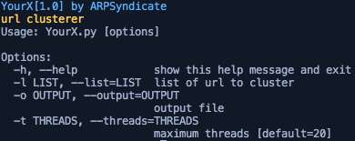

# YourX | URL Clusterer

## Screenshots

## Instructions for running
1. Install requirements using `pip3 install -r requirements.txt`.
2. Run `python3 YourX.py -h`.  

**COMPATIBILITY TESTED ON ARCHLINUX(x64), DEBIAN(x64) & WINDOWS10(x64) ONLY** 
**FEEL FREE TO SUBMIT PULL REQUESTS**